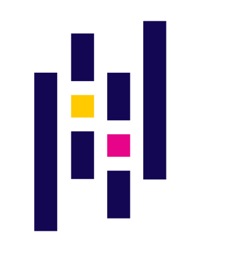

# 👋Hi there I'm Vatsal Bajaj

## I'm a Data Science and Machine Learning Enthusiast

* 🔭 I’m currently working on enhancing my programming skills and knowledge
* 🌱 I’m currently learning everything
* 👯 I’m looking to collaborate on different data science & deep learning projects
* 💬 Ask me about anything

<details>
    <summary>
        My Life in Code
    </summary>

```python
if __name__ == "__main__":
    while(alive, 😀):
        eat(🍴)
        sleep(😴)
        code(👨‍💻)
```
</details>


## Connect with me
<a href="https://linkedin.com/in/vatsalbajaj">
    
</a>
<a href="mailto:vatsalb61@gmail.com">
    
</a>

<br>
<br>

## Currently improving my knowledge and skills in this Tech Stack




<br>
<br>
<br>


<br>
<br>
<br>


<br>
<br>
<br>
<br>

<!-- space to add more -->