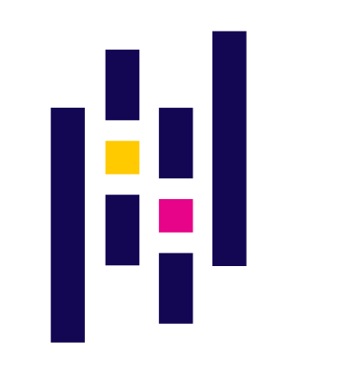

# 👋Hi there I'm Vatsal Bajaj

## I'm a Data Science and Machine Learning Enthusiast

- 🔭 I’m currently working on enhancing my programming skills and knowledge
- 🌱 I’m currently learning everything
- 👯 I’m looking to collaborate on diffrent data science & deep learning projects
- 💬 Ask me about anything

<br>

<div aling="right">

</div>

```python
if __name__ == "__main__":
    while(alive, 😀):
        eat(🍴)
        sleep(😴)
        code(👨‍💻)
```
<br>

## Connect with me
<a href="https://linkedin.com/in/vatsalbajaj">
    
</a>
<a herf="mailto:vatsalb61@gmail.com">
    
</a>
<a href="https://www.instagram.com/bajaj_vatsal/">
    
</a>
<a href="https://www.instagram.com/bajajvatsal_/">
    
</a>

<br>
<br>

## Tech Stack


<br>
<br>





<br>
<br>


<br>
<br>
<br>
<br>
<div style="text-align: center"> 
Credit to <a href="giphy.com">Giphy</a> and <a href="https://www.wikimedia.org/">Wikimedia</a>
</div>
